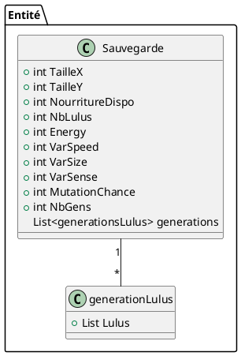

# Diagramme de base de données

```plantuml
@startuml
top to bottom direction
skinparam linetype ortho
package Entité {
    class "Sauvegarde" as save {
        + int TailleX
        + int TailleY
        + int NourritureDispo
        + int NbLulus
        + int Energy
        + int VarSpeed
        + int VarSize
        + int VarSense
        + int MutationChance
        + int NbGens
        List<generationsLulus> generations
    }

    class "generationLulus" as genlulu {
        + List Lulus
    }

    save "1"--"*" genlulu
}

```
