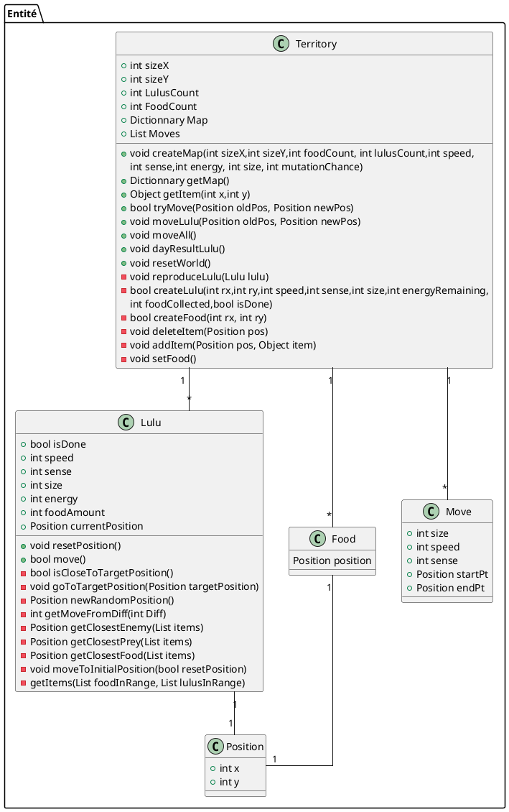

# Analyse détaillée

```plantuml
@startuml
top to bottom direction
skinparam linetype ortho
package Entité {
    class "Lulu" as lulu {
        + bool isDone
        + int speed
        + int sense
        + int size
        + int energy
        + int foodAmount
        + Position currentPosition

        + void resetPosition()
        + bool move()
        - bool isCloseToTargetPosition()
        - void goToTargetPosition(Position targetPosition)
        - Position newRandomPosition()
        - int getMoveFromDiff(int Diff)
        - Position getClosestEnemy(List items)
        - Position getClosestPrey(List items)
        - Position getClosestFood(List items)
        - void moveToInitialPosition(bool resetPosition)
        - getItems(List foodInRange, List lulusInRange)
    }


    class "Food" as nourriture {
        Position position
    }

    class "Territory" as territoire {
        + int sizeX
        + int sizeY
        + int LulusCount
        + int FoodCount
        + Dictionnary Map
        + List Moves

        +void createMap(int sizeX,int sizeY,int foodCount, int lulusCount,int speed,
        int sense,int energy, int size, int mutationChance)
        + Dictionnary getMap()
        + Object getItem(int x,int y)
        + bool tryMove(Position oldPos, Position newPos)
        + void moveLulu(Position oldPos, Position newPos)
        + void moveAll()
        + void dayResultLulu()
        +void resetWorld()
        -void reproduceLulu(Lulu lulu)
        -bool createLulu(int rx,int ry,int speed,int sense,int size,int energyRemaining,
        int foodCollected,bool isDone)
        -bool createFood(int rx, int ry)
        -void deleteItem(Position pos)
        -void addItem(Position pos, Object item)
        -void setFood()
    }
    class "Move" as move {
        + int size
        + int speed
        + int sense
        + Position startPt
        + Position endPt
    }

    class "Position" as position {
        + int x
        + int y
    }
}

territoire "1" -- "*" lulu
territoire "1" -- "*" nourriture
territoire "1" -- "*" move

lulu "1" -- "1" position
nourriture "1" -- "1" position

```
