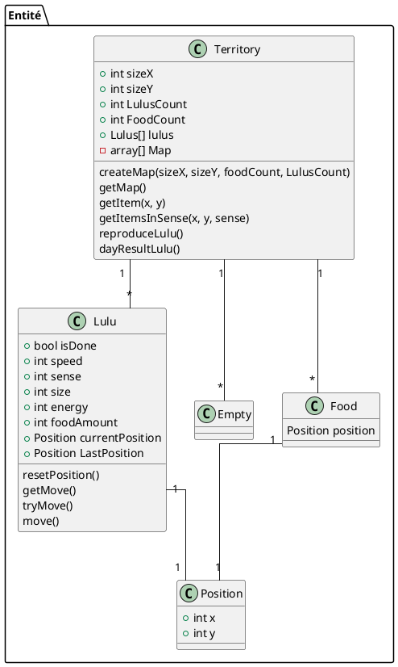

# Analyse détaillée

```plantuml
@startuml
top to bottom direction
skinparam linetype ortho
package Entité {
    class "Lulu" as lulu {
        + bool isDone
        + int speed
        + int sense
        + int size
        + int energy
        + int foodAmount
        + Position currentPosition
        + Position LastPosition

        resetPosition()
        getMove()
        tryMove()
        move()
    }

    class "Empty" as vide {
    }

    class "Food" as nourriture {
        Position position
    }

    class "Territory" as territoire {
        + int sizeX
        + int sizeY
        + int LulusCount
        + int FoodCount
        + Lulus[] lulus
        - array[] Map

        createMap(sizeX, sizeY, foodCount, LulusCount)
        getMap()
        getItem(x, y)
        getItemsInSense(x, y, sense)
        reproduceLulu()
        dayResultLulu()
    }

    class "Position" as position {
        + int x
        + int y
    }
}

territoire "1" -- "*" lulu
territoire "1" -- "*" nourriture
territoire "1" -- "*" vide

lulu "1" -- "1" position
nourriture "1" -- "1" position

```